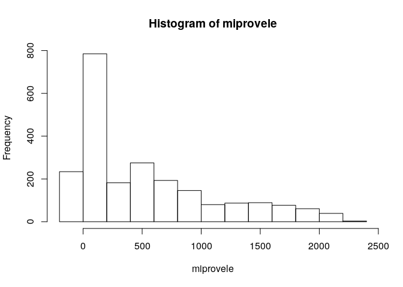

Unidad 1, asignación 2: exportar datos, leer ráster y extraer valores
=====================================================================

Sigo ayudando con `...`. Donde quiera que los veas, deberás sustituirlos por lo que indique el correspondiente mandato.

Dentro de las opciones de `knitr`, en el encabezado de este archivo, es probable que encuentres el argumento `eval = F`. Antes de tejer debes cambiarlo a `eval = T`, para que evalúe los bloques de código según tus cambios.

Provincia asignada
------------------

Toma nota del código de tu provincia asignada aleatoriamente.

``` r
 # abreviatura provaleatoria
 #       acade            11
 #       agrie            09
 #       aleir            10
 #       arqco            16
 #       cindy            12
 #       franc            23
 #       geora            08
 #       hoyod            22
 #       ingan            07
 #       ingdi            19
 #       itac9            15
 #       ivanv            25
 #       lbine            30
 #       leona            24
 #       magda            20
 #       maryj            02
 #       masue            26
 #       mmvol            13
 #       naui2            29
 #       rober            27
 #       wilne            06
 #       yoenn            21
```

Paquetes
--------

-   Carga el paquete `sf` y el paquete `raster`.

``` r
library(sf)
## Linking to GEOS 3.7.1, GDAL 2.4.2, PROJ 5.2.0
library(raster)
## Loading required package: sp
```

Exporta
-------

-   Determina el nombre de la capa provincias con `st_layers` del archivo GeoPackage que se encuentra en la carpeta `data`.

-   Carga la capa de provincias con la función `st_read`, asignándola al objeto `prov`.

-   Genera el objeto `miprov` que sólo contenga tu provincia.

-   Usando la función `st_write`, exporta el objeto `miprov` como GeoPackage a la carpeta `data` con el nombre `miprovexportado.gpkg`.

-   Lee el archivo exportado con la función `st_read` y asígnalo al objeto `miprovexportado`. Dado que sólo tiene una capa, no tienes que especificar el argumento `layer`.

-   Imprime en pantalla el objeto `miprovexportado` (sólo necesitas escribir el nombre del objeto).

``` r
st_layers('data/divisionRD.gpkg')
## Driver: GPKG 
## Available layers:
##      layer_name geometry_type features fields
## 1 PROVCenso2010       Polygon       32      4
## 2  MUNCenso2010       Polygon      155      5
## 3  REGCenso2010       Polygon       10      2
prov <- st_read(dsn = 'data/divisionRD.gpkg', layer = 'ProvCenso2010')
## Reading layer `ProvCenso2010' from data source `/home/aleir/unidad-1-asignacion-2-rasters-y-exportar-datos-espaciales-aleira/data/divisionRD.gpkg' using driver `GPKG'
## Simple feature collection with 32 features and 4 fields
## geometry type:  MULTIPOLYGON
## dimension:      XY
## bbox:           xmin: 182215.8 ymin: 1933532 xmax: 571365.3 ymax: 2205216
## epsg (SRID):    32619
## proj4string:    +proj=utm +zone=19 +datum=WGS84 +units=m +no_defs
miprov <- prov[prov$PROV %in% '10', ]
st_write(obj = miprov, dsn = 'data/miprovexportado.gpkg', driver = 'GPKG')
## Updating layer `miprovexportado' to data source `data/miprovexportado.gpkg' using driver `GPKG'
## Updating existing layer miprovexportado
## Writing 1 features with 4 fields and geometry type Multi Polygon.
miprovexportado <- st_read(dsn = 'data/miprovexportado.gpkg')
## Reading layer `miprovexportado' from data source `/home/aleir/unidad-1-asignacion-2-rasters-y-exportar-datos-espaciales-aleira/data/miprovexportado.gpkg' using driver `GPKG'
## Simple feature collection with 2 features and 4 fields
## geometry type:  MULTIPOLYGON
## dimension:      XY
## bbox:           xmin: 182215.8 ymin: 2007131 xmax: 266285.8 ymax: 2068858
## epsg (SRID):    32619
## proj4string:    +proj=utm +zone=19 +datum=WGS84 +units=m +no_defs
miprovexportado
## Simple feature collection with 2 features and 4 fields
## geometry type:  MULTIPOLYGON
## dimension:      XY
## bbox:           xmin: 182215.8 ymin: 2007131 xmax: 266285.8 ymax: 2068858
## epsg (SRID):    32619
## proj4string:    +proj=utm +zone=19 +datum=WGS84 +units=m +no_defs
##   PROV REG     TOPONIMIA ENLACE                           geom
## 1   10  06 INDEPENDENCIA   0610 MULTIPOLYGON (((205698.2 20...
## 2   10  06 INDEPENDENCIA   0610 MULTIPOLYGON (((205698.2 20...
```

Ráster
------

-   Con la función `raster`, carga el modelo digital de elevaciones que se encuentra en la carpeta `data`. Es el único archivo de extensión `.tif` Asígnalo al objeto `mde`

-   Genera un mapa con la función `plot`, usando la paleta de colores `terrain.colors`.

``` r
mde <- raster('data/mde_rd.tif')
plot(mde, col = terrain.colors(n = 255))
```


Extraer valores del ráster
--------------------------

-   Con la función `raster::extract`, extrae los valores de elevación correspondientes a tu provincia. Utiliza `mde` como objeto ráster y `miprov` como capa zonal. Asigna los valores al objeto `miprovele`.

-   Imprime en pantalla el objeto `miprovele` (sólo necesitas escribir el nombre del objeto).

-   Obtén los estadísticos descriptivos básicos (mínimo, primer cuartil, media, mediana, tercer cuartil, máximo) de `miprovele` con la función `summary`.

-   Genera un histograma de `miprovele` usando la función `hist`.

``` r
miprovele <- raster::extract(mde, miprov)[[1]]
miprovele
##    [1] 1704.98 1847.80 1900.09 1488.66 1591.06 1727.14 1783.71 1812.74
##    [9] 1896.99 1926.24 1929.29 1942.38 1390.29 1462.56 1412.48 1504.26
##   [17] 1613.56 1805.03 1873.07 1884.88 1894.09 1964.06 2047.19 2083.25
##   [25] 2102.20 1269.65 1341.22 1386.94 1519.30 1648.63 1665.99 1508.41
##   [33] 1484.82 1622.79 1782.04 1911.42 1923.55 1936.94 1938.40 1921.81
##   [41] 1852.51 1817.34 1818.40 1816.62 1803.85 1784.48 1659.41 1574.99
##   [49] 1634.87 1695.09 1706.66  872.79  750.92  928.42  768.06 1149.52
##   [57] 1239.76 1257.23 1331.53 1502.17 1485.00 1337.56 1203.70 1349.06
##   [65] 1510.59 1724.06 1758.85 1756.98 1703.31 1633.99 1595.73 1560.45
##   [73] 1496.87 1418.82 1390.94 1353.68 1291.99 1292.33 1429.93 1551.83
##   [81] 1522.88 1704.46  842.98  588.70  629.44  829.84  631.34  817.50
##   [89]  785.95  806.05  899.03  879.18  916.68  913.33 1031.57 1266.71
##   [97] 1171.22 1158.40 1010.65 1304.70 1564.95 1680.31 1703.87 1687.78
##  [105] 1623.93 1534.85 1512.47 1448.13 1275.98 1215.90 1182.76 1200.33
##  [113] 1230.94 1237.45 1231.18 1209.51 1199.62 1283.41 1479.50  403.83
##  [121]  589.89  637.64  406.36  651.40  778.52  567.01  642.59  709.58
##  [129]  626.92  559.12  766.43  836.00  979.62 1060.01 1107.29 1180.81
##  [137]  808.28  689.46  800.64 1067.90 1114.91  927.48  859.78  906.00
##  [145] 1255.60 1512.92 1574.91 1585.65 1558.55 1530.52 1501.88 1461.20
##  [153] 1399.40 1233.64 1156.83 1223.66 1423.44 1533.85 1462.63 1318.35
##  [161] 1334.99 1366.34  122.72  197.10  279.08  323.59  301.90  532.45
##  [169]  481.80  282.08  273.98  353.17  450.10  781.14  764.86  689.29
##  [177]  899.86 1020.70  956.73  807.35  878.96  968.98  898.02  905.33
##  [185] 1007.15  881.76  639.56  667.69  887.32 1017.60  939.58  860.02
##  [193]  801.54  989.02 1060.33 1252.00 1354.51 1373.53 1359.09 1402.47
##  [201] 1411.45 1392.24 1376.47 1252.85 1133.00 1182.40 1313.18 1447.53
##  [209] 1486.20 1434.57  125.34  126.14  228.90  217.34  170.42  319.27
##  [217]  441.72  610.30  726.14  522.38  512.41  801.19  979.40  952.08
##  [225]  898.26  712.65  622.67  634.14  699.26  708.38  692.51  559.37
##  [233]  728.08  809.56  799.18  793.58  778.38  764.22  959.70  812.52
##  [241] 1008.45 1135.68 1019.84 1144.47 1093.08 1062.36  997.82  973.45
##  [249]  998.90  998.61  955.97  941.91 1021.77 1212.53   23.73   44.09
##  [257]   35.73   77.01  108.18  110.73  320.87  439.02  487.10  361.62
##  [265]  303.52  561.24  736.65  766.61  768.06  770.87  640.84  537.24
##  [273]  552.80  578.42  506.97  466.03  516.68  550.77  623.26  610.77
##  [281]  630.18  651.19  712.38  579.74  843.82  848.55  651.38  794.23
##  [289]  741.40  666.63  637.76  625.74  627.40  543.78  583.99  584.47
##  [297]  766.46 1071.61 1113.23 1194.45   26.15   56.51   80.52   76.01
##  [305]   65.42   82.37  197.17  201.69  135.06  414.84  315.86  401.85
##  [313]  603.07  703.93  690.50  639.70  490.54  432.44  396.86  410.10
##  [321]  440.33  545.32  592.98  566.34  564.56  445.61  413.66  409.26
##  [329]  548.16  463.11  436.54  564.72  454.16  463.60  463.83  394.22
##  [337]  356.88  332.50  314.39  400.15  648.68  708.98  714.93  816.26
##  [345]   56.03   87.10  102.83   85.65   39.40   17.91   18.52   48.22
##  [353]  257.37   89.41  321.80  342.50  478.91  592.50  579.30  579.30
##  [361]  517.33  410.00  476.25  477.85  532.53  515.78  531.04  568.57
##  [369]  515.98  294.43  272.98  366.56  266.36  305.47  318.51  364.30
##  [377]  438.51  402.14  318.86  277.08  245.41  237.95  267.08  373.53
##  [385]  474.13  634.86  580.51   24.81   46.73   69.91   95.96   66.53
##  [393]   38.48    7.34   -3.48   24.99    8.45   76.82  179.80  383.40
##  [401]  561.81  703.97  750.34  715.33  502.00  511.57  498.68  515.30
##  [409]  505.41  547.62  521.46  504.46  366.26  175.37  240.91  191.63
##  [417]  224.65  438.37  443.15  461.69  436.73  431.19  389.40  297.67
##  [425]  220.80  203.38  290.97  429.37  571.29   21.29   28.18   48.16
##  [433]   73.38   72.24   43.75   16.42    0.50   -4.88   12.16  157.19
##  [441]  283.99  255.51  548.25  695.17  736.81  514.80  589.68  690.70
##  [449]  562.92  568.72  551.65  493.04  312.61  226.66   90.53   72.66
##  [457]   95.01  304.19  461.59  454.49  524.70  568.53  623.92  634.62
##  [465]  509.88  434.63  283.43  221.46  361.41   34.92   26.13   32.32
##  [473]   51.55   70.52   75.72   51.08   22.48    3.87   -5.47   13.09
##  [481]   24.44   85.01  304.55  463.56  570.70  407.21  460.19  700.81
##  [489]  743.80  582.82  496.11  359.30  217.07   86.27   26.14   32.15
##  [497]   60.89  129.06  249.76  351.74  531.95  561.08  541.02  504.68
##  [505]  530.60  420.75  169.00  158.96  288.90   80.20   40.33   42.30
##  [513]   55.29   64.16   68.36   62.81   53.68   21.68   -9.24   -1.98
##  [521]    9.70   80.33  222.77  326.81  398.13  377.57  375.84  527.14
##  [529]  383.61  373.30  254.46  173.33   56.50    6.56  -10.80  -28.70
##  [537]   59.68  206.85  159.07  186.32  207.95  220.19  197.51  102.26
##  [545]  171.84  229.74   89.74   35.83   39.55   47.66   61.77   75.67
##  [553]   81.41   73.93   29.30  -14.44  -26.82  -28.78   30.50   35.29
##  [561]  208.59  298.94  240.93  233.13  221.44  180.23  193.66  166.96
##  [569]   60.10   -4.89  -31.09  -31.83   -7.60   21.61   48.42   69.41
##  [577]   60.29  126.09   72.79   40.94   38.80   53.72   80.27   81.64
##  [585]   83.18   68.18    7.25  -28.18  -33.48  -35.55  -32.87  -25.22
##  [593]    0.14   32.51   73.14   94.59  101.39  114.21   87.39   36.90
##  [601]   -6.98  -36.70  -34.35   -9.83   15.82   35.78   70.70  105.32
##  [609]   56.21   50.48   64.12   74.10   74.85   63.59    6.19  -27.33
##  [617]  -35.36  -37.24  -38.05  -34.13  -28.23    0.33   35.44   59.52
##  [625]   70.66   63.73   22.27  -12.59  -33.85   -9.62    8.18   35.34
##  [633]  104.49   63.76   60.13   66.73   73.83   53.00    2.89  -29.24
##  [641]  -34.79  -32.70   -6.22   21.15   33.94   37.04   26.73    4.04
##  [649]  -26.49  -37.77  -32.55  127.28   93.85   65.16   56.28   57.52
##  [657]   18.41  -27.13  -34.20  -38.97  -34.77  -15.26    2.96    6.58
##  [665]    5.81   -2.57  -19.34   96.73   89.12   70.55   53.74   32.76
##  [673]   -2.23  -27.36  -33.63  -36.89  -37.85  -33.75  -29.81  -28.83
##  [681]  -27.33  -28.59   46.34   69.92   82.82   51.85    4.93   -4.56
##  [689]  -17.27  -27.84  -37.68   20.19   28.37   42.22   46.29   30.49
##  [697]   14.17    3.27   -8.75  -29.51   28.90   31.86   45.02   56.68
##  [705]   54.18   96.01   89.13   43.67   18.49   -0.81   -9.11  -17.85
##  [713]  363.50  439.54  482.55  373.47  151.70   52.36   70.02   82.34
##  [721]   68.92  128.44  235.37  207.34  131.08   62.06   28.59   11.42
##  [729]   -4.60  -14.27  -23.19  -35.01  572.59  534.11  419.00  234.36
##  [737]  116.95  130.10  127.21  118.54  112.26  135.72  275.07  293.11
##  [745]  123.74   68.14   39.08   13.04   53.67   59.38  -20.70  -36.08
##  [753]  676.35  625.81  483.13  358.91  231.22  231.05  203.40  283.54
##  [761]  222.64  143.03  164.31  205.15  215.55  193.03  191.13  116.34
##  [769]  142.06   80.11   14.50  -16.60  -31.98  640.13  619.93  586.36
##  [777]  572.17  342.14  261.07  283.71  279.73  224.66  141.96  125.09
##  [785]  118.94  140.54  204.07  165.47  106.20   79.22   74.07   17.43
##  [793]   11.29  -16.63  -28.98  -36.82  418.53  377.60  427.91  364.43
##  [801]  399.78  355.03  271.23  205.11  172.54  159.41  119.92   86.51
##  [809]   64.41   68.98  107.01   36.89    3.08   -8.59  -24.18  -28.99
##  [817]  -38.11  -36.71  755.58  679.49  501.61  385.21  315.44  139.33
##  [825]   86.20   66.70   54.80   71.29  110.98   88.23   62.88   93.64
##  [833]   41.84   50.78   22.92   -0.39    3.15   24.00  -26.79  -38.40
##  [841]  -36.77  -36.07  -33.25  661.62  593.22  333.25  126.24   86.41
##  [849]   57.11   36.85   28.52   29.67   72.39  114.14  134.38   80.06
##  [857]  122.37   83.68   21.53   -4.78   -8.51   -1.38    4.93  -16.23
##  [865]  -31.00  -40.60  -40.05  -38.37  -36.24  -35.41  -33.45  -31.20
##  [873]  651.01  344.44  184.87  121.24   86.48   92.32   56.14   20.95
##  [881]   19.04   33.30   41.20   56.18   60.97   67.16   35.24   11.53
##  [889]   -2.74    9.47   14.12   -3.00    5.52   36.82    8.87  -41.17
##  [897]  -40.15  -38.07  -35.50  -35.55  -35.91  -35.53  -35.50  -33.93
##  [905]  -32.10  535.35  283.24  238.09  150.21  164.73  117.88   30.11
##  [913]   16.27   15.12   15.97   17.67   18.47   19.00   30.56   33.38
##  [921]   23.51   18.25   38.27   18.74    6.47   42.83   88.55   32.12
##  [929]   -6.57  -33.29  -41.34  -40.62  -39.57  -38.91  -37.52  -36.87
##  [937]  -35.92  -35.11  -34.23  -34.61  -34.68  -34.53  -33.25  -31.70
##  [945]  -29.42  -27.05  -25.23  555.43  376.53  337.67  291.23  248.31
##  [953]  172.03   74.43   40.51   17.45   11.38   11.26   14.45   14.55
##  [961]   10.80   11.23   17.64   16.54   52.18  115.25   72.91   61.47
##  [969]   86.22   33.69    7.90   -7.69  -34.69  -39.58  -38.16  -36.79
##  [977]  -36.89  -35.55  -35.86  -33.03  -32.17  -31.88  -32.04  -31.95
##  [985]  -32.40  -33.53  -32.12  -30.49  -28.89  -27.16  -24.90  -22.10
##  [993]  -24.20  -21.75    6.25    6.59    6.97    7.09  504.64  492.44
## [1001]  447.87  406.90  233.70  195.38  101.76   42.85   18.38   10.18
## [1009]   10.92   12.77   15.81   14.65   11.60   11.30   22.77   50.11
## [1017]  113.39  182.74  206.74  121.93   33.73    2.77  -18.59  -11.23
## [1025]   -1.84  -18.26  -21.22  -22.09  -31.24  -32.63  -32.30  -29.31
## [1033]  -29.11  -27.82  -27.50  -28.34  -29.44  -29.31  -28.19  -27.09
## [1041]  -24.70  -22.68  -20.69  -21.31  -20.43  -22.42    5.42    5.73
## [1049]    6.07    7.11    8.67   10.45  457.37  355.52  262.88  186.02
## [1057]  219.53   83.52   37.55   22.18   23.08   35.51   60.32   40.71
## [1065]   29.30   30.02   40.72   60.57  107.59  180.35  221.66  130.41
## [1073]  128.78  138.00  130.36  117.95  179.53  193.27  119.72   45.62
## [1081]   -3.43   -7.87  -20.97  -23.08  -21.41  -19.52  -21.60  -24.71
## [1089]  -25.71  -25.81  -24.04  -22.51  -21.09  -18.46  -14.24  -13.64
## [1097]  -14.31  -17.08    5.46    5.57    6.42    6.89    7.75    9.06
## [1105]   11.11   10.56   10.33  617.93  457.79  430.31  574.80  573.77
## [1113]  429.05  331.84  232.84  161.33  208.46  202.52  137.75   87.91
## [1121]   53.76   57.64   69.60   94.95  164.53  256.75  339.38  360.79
## [1129]  390.03  399.33  416.11  539.69  540.02  432.36  260.59  132.39
## [1137]   60.17    5.10  -16.64  -14.87  -14.09   -9.36    2.71  -12.35
## [1145]  -18.84  -18.87  -20.06  -18.72  -13.56  -10.39   -6.79   -7.06
## [1153]  -12.79    4.11    4.85    6.09    6.89    6.62    9.98    9.18
## [1161]   10.05   10.68   12.10   12.54   10.90  752.74  727.66  815.87
## [1169]  874.78  874.12  772.93  701.37  615.39  636.37  497.89  394.18
## [1177]  285.53  202.07  130.20   99.08  160.18  208.38  320.43  473.02
## [1185]  501.11  532.96  646.30  644.88  593.66  580.68  578.04  560.02
## [1193]  436.29  323.67  125.67   25.01    1.31   -1.83  -10.73   -1.23
## [1201]   13.07   21.52   -6.24  -13.47  -12.92  -10.45   -7.84   -6.37
## [1209]   -5.56   -6.56   -1.31    4.09    5.33    6.18    6.41    7.00
## [1217]   12.91   13.59   11.52   12.39   13.30   12.97   12.80   12.45
## [1225] 1014.95 1036.18  955.27  905.80  916.81  899.06  855.56  752.77
## [1233]  642.44  434.67  328.33  222.46  150.33  323.41  312.66  368.25
## [1241]  443.37  482.39  502.53  574.71  667.10  661.90  536.94  528.56
## [1249]  541.27  515.50  448.18  300.03  128.38   34.84    6.53   -6.41
## [1257]   -8.17    0.92   23.29    8.29    1.74    1.44    1.20   -2.09
## [1265]   -4.19   -3.74   -3.24   -2.40   -0.80    2.03    0.64   -2.41
## [1273]    3.94    6.14    6.13    8.21   10.80   12.30   13.12   12.40
## [1281]   12.38   13.42   13.58   13.44   13.14  995.16  936.39  896.95
## [1289]  914.15  847.35  810.44  791.56  754.27  649.15  468.07  521.15
## [1297]  535.27  485.25  426.68  458.86  517.13  541.31  525.84  569.28
## [1305]  519.27  488.96  502.55  420.84  300.93  214.11  161.20  107.26
## [1313]  114.91   50.91   34.79    2.25    5.92    6.84   15.15   14.44
## [1321]   14.13    3.00    3.70   -0.91   -0.51    1.76    0.36    2.22
## [1329]    3.92   -0.64    0.34    4.61    6.11    8.00   11.94   10.35
## [1337]   13.32   14.18   13.60   14.18   14.41   15.12   15.59  934.11
## [1345]  887.75  859.44  896.73  896.95  893.94  847.08  744.03  662.04
## [1353]  532.61  524.83  503.13  532.75  512.38  493.78  509.32  478.40
## [1361]  440.94  415.79  410.70  391.49  505.54  454.00  246.26  153.94
## [1369]  256.63  242.09  141.74   68.27   17.74   35.34   61.89   56.31
## [1377]   42.69   16.92   10.95    4.65    5.11    5.28    1.91    1.61
## [1385]    4.87    4.86   -0.94    4.05    5.12    7.47    8.51   11.33
## [1393]   13.97   13.84   14.35   15.20   15.57   15.62   15.86   16.70
## [1401]  892.17  839.23  817.71  825.38  838.33  797.39  587.96  618.51
## [1409]  660.64  531.45  509.55  521.74  443.80  450.45  484.78  503.08
## [1417]  405.61  421.04  515.67  543.04  433.52  222.29  271.24  277.08
## [1425]  239.80  223.35  149.51   48.98   85.53  101.01  110.48   60.85
## [1433]   32.87   37.33   16.59    9.72    7.40    2.06    1.31    4.67
## [1441]    2.64    4.74    6.87    8.31   10.43   11.96   10.05   11.83
## [1449]   14.50   15.25   17.26   17.74   17.37   17.99  915.99  805.02
## [1457]  712.44  775.71  609.84  750.60  760.70  730.49  644.85  572.22
## [1465]  456.96  504.43  481.60  464.50  452.91  425.81  442.82  463.61
## [1473]  409.75  264.03  297.39  308.67  281.19  223.70  122.91   61.68
## [1481]   34.47   46.24   54.64   58.59   52.35   41.57   30.95   15.10
## [1489]   13.58    8.46    5.51    4.20    7.06    7.86    6.80    7.86
## [1497]   10.94   12.04   11.81   13.12   14.76   15.44   17.13   19.18
## [1505]   19.26   19.65   18.95 1082.60  972.10  834.49  720.73  632.99
## [1513]  633.81  734.70  767.28  783.34  749.03  675.03  486.20  510.44
## [1521]  424.86  434.33  480.53  480.82  461.07  418.16  326.23  306.67
## [1529]  359.94  378.61  380.37  345.30  265.43  190.43  106.16   47.58
## [1537]   30.66   28.80   26.33   18.91   27.41   32.95   24.69   20.32
## [1545]   13.00    7.60    7.45    7.71    7.83    8.52   11.91   12.52
## [1553]   11.60   13.24   14.04   14.49   15.95   16.85   17.44   18.24
## [1561]   17.64   18.77   20.57 1339.54 1206.53 1066.18  939.71  823.33
## [1569]  721.35  648.84  689.97  672.52  644.80  639.55  589.66  537.30
## [1577]  476.08  414.71  412.78  412.50  449.55  516.40  475.26  384.78
## [1585]  361.27  405.83  449.07  457.41  501.06  479.83  414.38  315.16
## [1593]   82.53   51.53   37.01   40.69   22.12   18.20   70.39   31.95
## [1601]   26.43   18.63   15.48   10.47   10.83   11.33   11.80   12.22
## [1609]   11.56   12.77   13.19   13.83   14.11   15.04   15.88   17.12
## [1617]   17.53   20.46   26.35   30.03   29.59   39.82 1442.47 1355.63
## [1625] 1289.42 1209.29 1007.96  844.41  746.90  714.86  758.31  722.76
## [1633]  632.98  588.97  593.20  475.37  426.47  421.19  410.23  400.87
## [1641]  427.02  454.24  448.39  373.68  522.10  602.75  628.07  568.80
## [1649]  625.39  597.68  511.50  183.52   92.03   47.55   36.32   22.21
## [1657]   27.90   50.93   59.98   30.92   26.99   27.75   17.85   13.90
## [1665]   12.40   12.53   11.39   10.24   11.63   10.92   12.44   13.40
## [1673]   14.98   15.61   16.86   19.26   25.81   28.55   19.06 1739.74
## [1681] 1759.72 1718.67 1603.15 1513.74 1334.80 1162.47  976.62  867.07
## [1689]  821.27  770.92  732.31  646.35  575.74  474.00  489.11  546.05
## [1697]  476.21  422.26  439.87  445.33  481.82  406.17  539.27  700.94
## [1705]  793.59  765.51  757.73  732.21  672.18  342.24  262.90   72.95
## [1713]   43.62   24.40   47.97   65.63   57.08   34.65   37.76   34.69
## [1721]   36.39   29.94   19.07   15.29   11.92   10.84   11.30   10.58
## [1729]   11.90   13.22   14.59   16.09   17.95   19.75   25.13   30.15
## [1737] 2035.25 2043.23 1988.03 1894.68 1844.71 1642.90 1465.63 1161.83
## [1745] 1072.45 1003.61  942.63  901.71  674.41  600.39  517.80  625.84
## [1753]  699.84  646.22  613.98  552.78  529.27  581.73  486.17  450.12
## [1761]  562.99  792.83  935.38  875.51  806.78  793.00  730.58  563.55
## [1769]  177.96   96.94   49.12   28.41   74.30   56.96   41.52   52.10
## [1777]   49.21   49.09   30.42   19.27   16.59   12.89   11.24   11.23
## [1785]   12.81   14.19   16.36   40.25   62.42   56.52   38.82   27.45
## [1793] 2243.31 2236.86 2120.45 2052.11 2069.58 1997.24 1834.14 1670.57
## [1801] 1521.07 1382.14 1156.67 1140.86 1097.29  954.64  966.08  771.86
## [1809]  695.56  800.45  799.71  702.38  690.84  675.55  683.10  574.60
## [1817]  529.29  588.15  604.58  827.40  922.40  858.43  851.53  838.66
## [1825]  792.68  544.80  353.82  173.66   69.46   35.00   71.31   67.76
## [1833]   62.88   27.51   24.69   22.29   22.77   13.63   13.62   14.53
## [1841]   15.32   10.03    5.05    5.00    5.00    5.00 2221.79 2127.48
## [1849] 2049.26 1989.60 1890.51 1807.91 1639.45 1324.52 1282.98 1336.43
## [1857] 1223.64 1174.47 1136.36  997.80  885.62  948.12  975.93  905.58
## [1865]  832.40  709.99  623.19  546.29  582.92  636.57  723.11  841.92
## [1873]  857.37  850.00  847.21  848.05  761.85  629.31  387.34  129.22
## [1881]   49.79   32.82   84.74  127.16   57.15   24.92   12.95   12.32
## [1889]   12.02    6.45    5.00    5.00    5.00    5.00    5.00 2184.66
## [1897] 2165.98 2142.13 2020.90 1966.87 1801.21 1698.89 1498.29 1518.59
## [1905] 1502.16 1375.81 1295.72 1257.73 1204.63  998.65 1098.03 1124.43
## [1913]  988.19  768.23  666.63  640.17  602.66  621.87  724.18  822.30
## [1921]  853.72  855.10  796.84  800.38  782.42  754.74  586.98  397.70
## [1929]  259.26   50.35   45.43   32.20   18.00   12.17    8.16    5.08
## [1937]    5.00    5.00    5.00 2179.47 2165.26 2105.98 2115.23 1991.01
## [1945] 1921.86 1742.01 1631.41 1697.28 1565.24 1418.05 1358.46 1331.92
## [1953] 1156.54 1113.97 1100.80 1173.21 1061.00  894.52  786.87  688.14
## [1961]  649.85  652.28  735.33  791.13  880.82  814.59  625.41  650.71
## [1969]  632.44  713.51  543.12  247.73   51.87   41.98   50.84    8.39
## [1977]    4.94    5.00    5.00 2177.40 2184.61 2108.68 2054.58 2001.74
## [1985] 1938.54 1818.74 1744.16 1695.24 1510.40 1389.64 1298.55 1289.30
## [1993] 1415.99 1315.22 1171.88 1150.08 1144.23 1102.22  962.97  771.72
## [2001]  741.13  713.21  752.65  794.76  848.77  673.97  450.18  363.23
## [2009]  396.04  347.96  155.59   76.01   51.18   48.57   54.65 2142.14
## [2017] 2108.48 2054.31 2035.06 1979.06 1874.70 1753.56 1641.26 1529.48
## [2025] 1430.03 1345.90 1433.08 1472.89 1403.65 1259.72 1229.32 1285.85
## [2033] 1233.65 1094.01  875.62  824.42  805.44  805.75  801.45  748.16
## [2041]  567.46  496.37  308.93  239.10  161.16   80.63   60.58   59.22
## [2049]   61.04 2172.01 2109.15 2111.76 2027.34 1914.27 1784.34 1706.96
## [2057] 1618.34 1467.06 1414.43 1393.07 1414.04 1423.10 1432.80 1362.87
## [2065] 1365.24 1279.79 1191.29  988.17  925.75  948.31  891.79  871.11
## [2073]  813.45  748.47  699.24  639.78  443.24  163.51   85.53   72.36
## [2081] 2167.78 2139.71 2096.42 2024.68 1907.05 1823.09 1782.97 1647.28
## [2089] 1568.96 1524.44 1455.12 1446.42 1514.15 1568.56 1489.12 1393.72
## [2097] 1322.81 1202.27 1104.09 1056.03 1061.26 1030.77  996.77  950.08
## [2105]  956.87  886.02  721.27  359.91  159.97   91.76 2175.09 2125.33
## [2113] 2073.61 1926.31 1917.24 1902.02 1793.41 1634.22 1566.50 1530.40
## [2121] 1528.01 1590.15 1629.56 1526.58 1414.46 1314.42 1274.35 1213.51
## [2129] 1120.20 1065.95 1074.31 1074.48 1030.20  982.25  880.63  697.24
## [2137]  354.62  128.59  110.74 1979.22 1985.68 1962.92 1877.48 1751.22
## [2145] 1652.56 1637.55 1672.14 1690.14 1668.17 1580.08 1519.80 1380.59
## [2153] 1260.39 1207.66 1117.62 1026.17 1015.79  986.73  925.77  855.38
## [2161]  641.12  336.08  177.07 1996.92 2012.03 1944.58 1842.09 1760.35
## [2169] 1753.44 1769.82 1770.87 1744.21 1693.42 1621.19 1523.16 1375.85
## [2177] 1219.37 1162.82 1092.98  991.24  923.04  862.79  769.65  580.08
## [2185]  544.49 1841.37 1785.75 1789.69 1811.16 1812.64 1787.94 1753.77
## [2193] 1683.78 1546.80 1360.84 1187.56 1099.84 1028.89 1065.62 1048.44
## [2201]  945.01  836.85  476.76 1793.98 1843.42 1840.55 1780.30 1679.68
## [2209] 1516.02 1336.72 1138.79 1035.38  998.26  977.65 1027.18  923.43
## [2217]  644.44 1856.45 1771.20 1657.84 1505.42 1301.43 1148.00 1091.63
## [2225]  883.18  740.24 1887.19 1826.97 1719.12 1593.59 1482.17 1348.47
## [2233] 1237.05 1887.41 1797.10 1668.63 1569.12 1483.08 1385.05 1842.05
## [2241] 1750.03 1624.87 1540.15 1464.45 1795.38 1703.20 1558.76 1499.04
## [2249] 1605.19 1501.82 1596.48
summary(miprovele)
##    Min. 1st Qu.  Median    Mean 3rd Qu.    Max. 
##  -41.34   20.52  314.39  514.58  816.07 2243.31
hist(miprovele)
```


